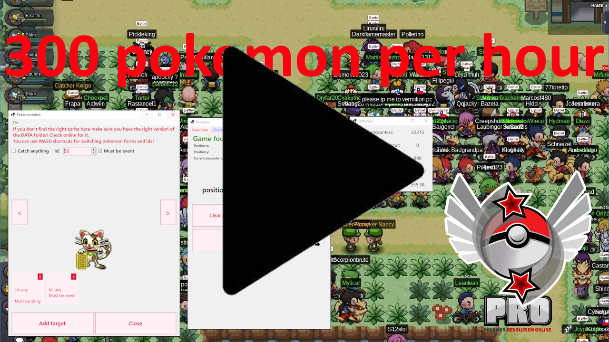

# PROHack

Windows-only desktop app that automates encounter hunting, detects special forms (shiny/event), logs encounter stats, and optionally notifies you over Discord.

<b>Supported OS:</b> Windows 10/11 64‑bit • <b>Target:</b> .NET 8 Windows • <b>Status:</b> Works as of 13/10/2025 <b>(game updates may break offsets)</b>

	

## What it does

- Walks back and forth between two in‑game positions (X or Y axis) to trigger encounters.
- Detects the current encounter’s Pokemon ID and whether it’s a shiny or event form.
- Beeps locally and can send a Discord announcement when a target matches your filters.
- Lets you pick targets (any/shiny/event or by specific ID) with a visual selector and sprite previews.
- Tracks encounter statistics with a simple dashboard: total, last hour, since last special, average encounters per special.
- Provides a hotkey to stop the bot instantly.
- Optional Discord remote commands: send a key to the game, take a desktop screenshot, check authorization, etc.

## Quick start

1) Build

- Open `ProHack.sln` in Visual Studio 2022+ and set `Presentation` as the startup project. Build in Release.
- Or use the .NET CLI to build the solution. The app targets `net8.0-windows`.

2) Run

- Start the PRO client and log in first.
- Launch PROHack; a short Loading screen will initialize local storage and (if present) the pokedex data and Discord bot.
- If the game is detected, the main window shows “Game found!”.

## Discord integration

The embedded Discord bot is private to you and supports a small set of commands.

Setup
1. Create an app at https://discord.com/developers/applications?new_application=true
2. In “Installation” set Install Link to “None”. In “Bot” disable “Public Bot”.
3. Enable the intents: Presence, Server Members, and Message Content.
4. Reset token and copy it. Keep it secret.
5. In OAuth2 > URL Generator, select “bot” and permissions: Send Messages, Attach Files, Read Message History. Invite it to your private server.
6. In PROHack open “Discord Options”. Paste the token and Save.
7. Click “Reboot bot” in the dialog. Status will show when connected.
8. In any channel, run `!get-user-id`, copy your ID, paste it in “Discord Options” as Authorized User and Save.
9. In your target channel, run `!set-announce-channel`.
10. Click “Send test message” in “Discord Options” to verify.

Commands

- `!help [command]` — list commands or show details for one
- `!get-user-id` — DM your user ID
- `!is-authorized` — check if the current user matches the configured authorized user
- `!set-announce-channel` — set the current channel for app announcements
- `!send-key <Key>` — send a key press to the game (Keys enum name)
- `!get-screenshot` — send a desktop screenshot
- `!echo <text>` — test echo

Security
- Only the configured Authorized User can run sensitive commands.
- Keep your token private and use a private server.

## Troubleshooting

- “Game not found” — ensure PRO is running and you’re logged in. If PRO runs elevated, run PROHack as admin.
- Discord bot won’t start — verify the token is correct, intents are enabled, and the bot isn’t public. Try “Reboot bot”.
- No sprites or names in selector — populate the `DATA` folder as described above.
- Bot walks out of bounds — re‑register positions; ensure you selected the correct axis.
- App stopped with an error — check the error box on the main form; offsets may be outdated after a game update.

## Development notes

Project layout

- `Presentation` — WinForms UI, app entry point (`Program.cs`, forms)
- `Application` — automation loop (`AutoFarm`), hotkey registration
- `Infrastructure` — memory manager, Discord bot (Discord.Net), pokedex loader, screenshot helper, simple XML database
- `Domain` — models and enums (targets, pokedex entries, selected menu)
